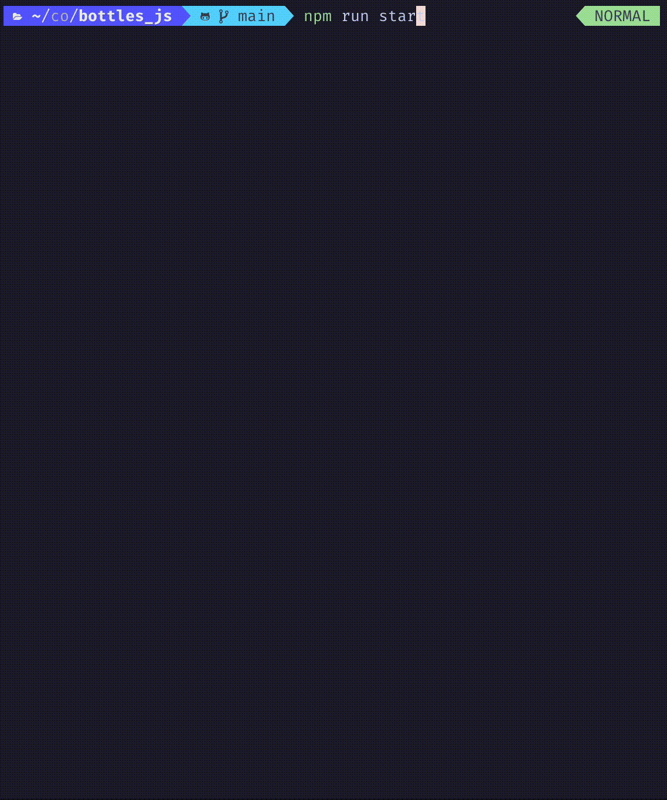

# bottles_js
> Water Sort Game CLI implementation written in TS.

## Installation
- cd into project folder
- install deps and build project with `npm install && npm run build`
- to run use `npm run start` command
